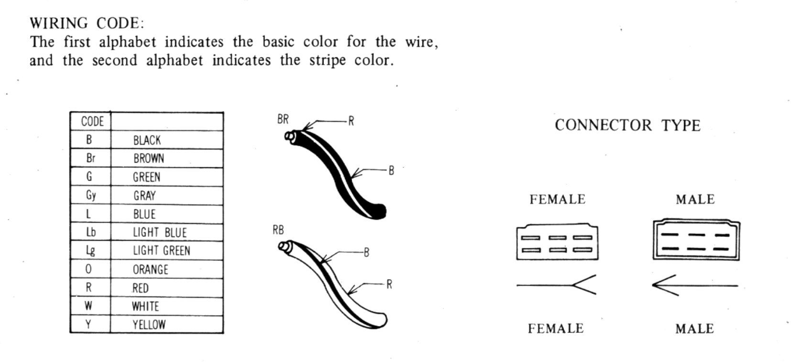

# Reading the Wiring Diagram

Useful tidbits of knowledge regarding the RX-7's electrical system.

## Electrical Color Code & Connectors

In the [available wiring diagrams](http://wright-here.net/cars/rx7/manuals.html#diagrams), the color codes are as follows;

| Code | Color       |
| ---- | ----------- |
| B    | Black       |
| Br   | Brown       |
| G    | Green       |
| Gy   | Gray        |
| L    | Blue        |
| Lb   | Light blue  |
| Lg   | Light Green |
| O    | Orange      |
| R    | Red         |
| W    | White       |
| Y    | Yellow      |

For wires with stripes (the majority), the first character refers to the primary color, and the second character refers to the stripe color.

For example, a `RB` wire will be primarily red with a black stripe.
