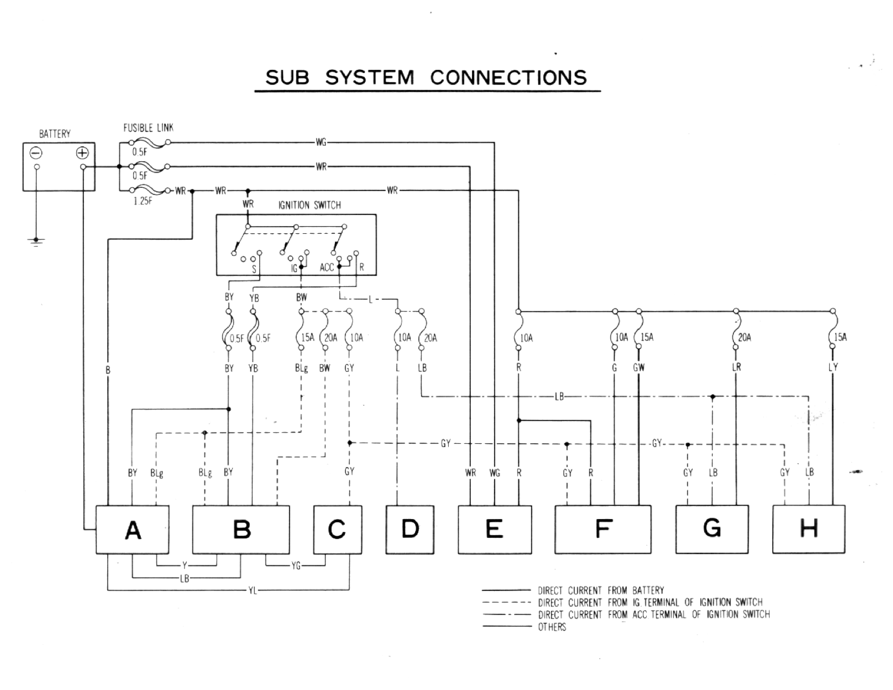
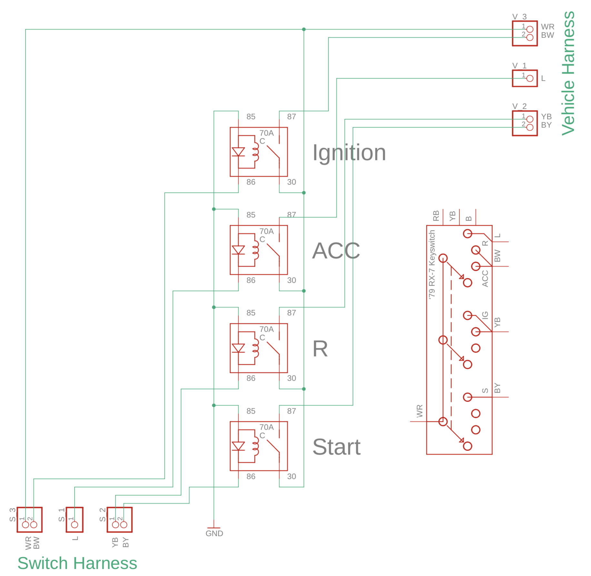

# Ignition Relays

Using relays to switch the electrical systems in your RX-7.

_As with all my modification write-ups, I suggest you read through the entire
document and make your own informed decisions before jumping in. These are the
steps and purchases I made, but there may be alternatives._

## Background

Early RX-7's run all their switched electrical current directly through the
ignition switch.

Switching direct current is prone to arcing, particularly when breaking the
connection in high current situations. This arcing will slowly wear out the
contacts and increase their resistance through carbon build-up, thereby creating
a greater voltage drop to all the downstream electrical systems.

The contacts in my own switch had worn to the point that the accessories would
not always stay on with the key in the on position. Though a replacement switch
rectified the problem, it would be only a matter of time until I faced it again.

## Research

It is important to have a full understanding of the electrical system and how
the ignition switch interacts with it; I've become far too familiar with the
[wiring diagram](http://wright-here.net/cars/rx7/manuals.html#diagrams) for my
'79, and suggest you do too.

Modern vehicles use [relays](https://www.12voltplanet.co.uk/relay-guide.html) to
switch their various electrical subsystems. This would be far more reliable and
easily sourced than the now old-stock replacement ignition switches.

User _Twilightoptics_ of [rx7club.com](http://rx7club.com) described his
approach for adding relays in his appropriately named thread [(ELECTRICAL) No
Relay's? What was Mazda
thinking?](https://www.rx7club.com/1st-gen-archive-71/electrical-no-relays-what-mazda-thinking-922262/).

Though I couldn't find anything through the usual electric suppliers, matching
connectors for the vehicle are available through [Eastern
Beaver](https://easternbeaver.com).

## Design

Consistent with my preference for reversible modifications, I chose to connect
my relays to the vehicle's existing wiring harness by using matching connectors.

### Schematic

TODO: The most important bit of this readme. The first version, lacking the
connection to ground through the check switch, is provided for the interim.

TODO: Label wire gauges, colors used.

### Mounting

Because space is limited in the dash beneath the steering column, I elected to
mount the relays in the center console area, against the HVAC unit. This could
be problematic if you have a deep stereo, though most newer units are fairly
compact.

### Finished Product

## Challenges

The schematics clearly illustrate the 4 primary connectors coming from the
ignition switch. However, there is an additional three terminal connector with
BR, RB, B wires- this is for the `Brake warning light checker` as illustrated in
the `Meter & Warning System` section of the wiring diagram. This connection
provided a useful connection to ground.

I chose 10 AWG wire, however this proved difficult to crimp and fit into some of
the connectors. Given the rest of the vehicle's wiring, 12 AWG would likely be
fine and be easier to work with. Use [this
calculator](https://www.wirebarn.com/Wire-Calculator-_ep_41.html) and make your
own judgement.

## Supplies

### Parts

- 4x 70 amp relays
  [Mouser](https://www.mouser.com/ProductDetail/song-chuan/897-1ah-c-001-12vdc/?qs=0kFKDc1CZSl%252b%252bYquRDHiHw%3D%3D&countrycode=US&currencycode=USD)
- 4x relay holders
  [Mouser](https://www.mouser.com/ProductDetail/littelfuse/99025/?qs=WuSE%2Fq7VyLz7BaA47%252bxdtg%3D%3D&countrycode=US&currencycode=USD)
- 10, 14 AWG wiring
  [Wirebarn](https://www.wirebarn.com/GXL-HIGH-TEMPERATURE-WIRE_c_4.html)
- Heatshrink tubing

#### Connectors

You'll likely want to purchase extras of the below terminals in case you mess up
a crimp.

##### Relay Crimp Connectors

- 2x A100538CT-ND (relays to 10 AWG wires)
  [Digikey](https://www.digikey.com/product-detail/en/te-connectivity-amp-connectors/280756-2/A100538CT-ND/2233413)
- 6x A107119CT-ND (relays to 10 AWG wires)
  [Digikey](https://www.digikey.com/products/en?keywords=A107119CT)
- 8x A27927CT-ND (relays to 14 AWG wires)
  [Digikey](https://www.digikey.com/products/en?keywords=A27927CT)

##### To Vehicle Harness and Switch

.312" Connectors

- 1x 1P312-3-5 Female (12-10 AWG) [Eastern
  Beaver](https://easternbeaver.com/Main/Elec__Products/Connectors/312_Connectors/312_connectors.html)
- 1x 1P312-3-5 Male (12-10 AWG) [Eastern
  Beaver](https://easternbeaver.com/Main/Elec__Products/Connectors/312_Connectors/312_connectors.html)
- 1x 2P312-3-5 Female (12-10 AWG) [Eastern
  Beaver](https://easternbeaver.com/Main/Elec__Products/Connectors/312_Connectors/312_connectors.html)
- 1x 2P312-3-5 Male (12-10 AWG) [Eastern
  Beaver](https://easternbeaver.com/Main/Elec__Products/Connectors/312_Connectors/312_connectors.html)

Yazaki CN(A) .250" Connectors

- 1x 2P250 Set (Male & Female) [Eastern
  Beaver](https://easternbeaver.com/Main/Elec__Products/Connectors/250_Connectors/250_connectors.html)
- 1x 3P250-CNA Set (Male & Female) [Eastern
  Beaver](https://easternbeaver.com/Main/Elec__Products/Connectors/250_Connectors/250_connectors.html)
- 2x 3 sq mm Male Brass Tab [Eastern
  Beaver](https://easternbeaver.com/Main/Elec__Products/Connectors/250_Connectors/250_connectors.html)

### Tools

- Wire strippers
- Crimp tool(s) capable of 7, 10, 14 AWG wires
- Heat gun (or hairdryer)
